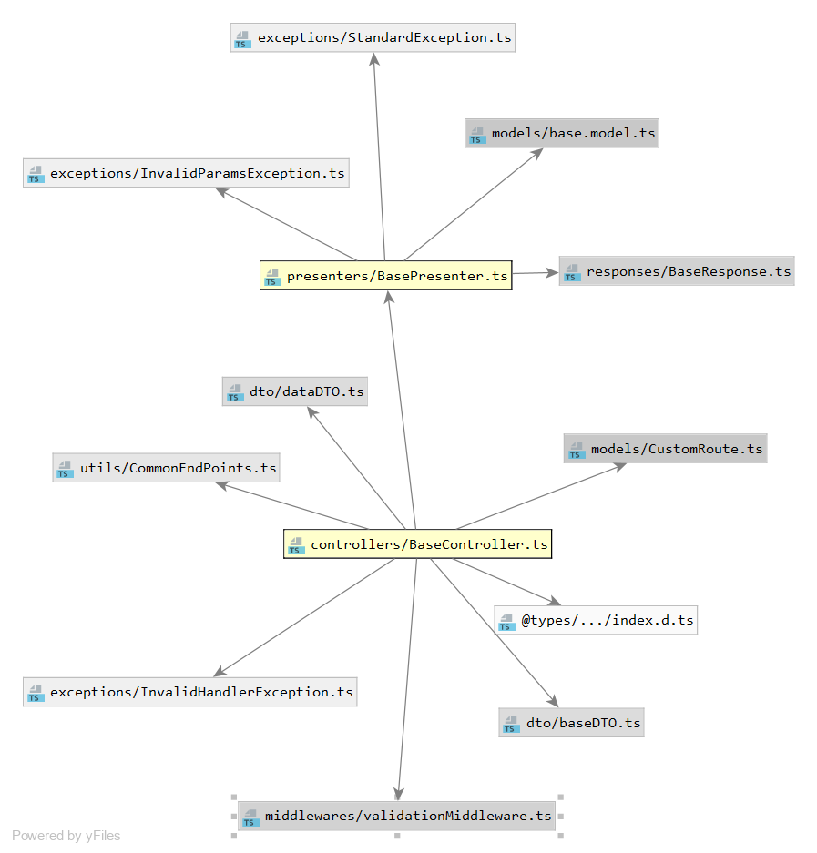

# Tangos
https://appening.github.io/Tangos/

Broilerplate code Node MongoDB server written in TypeScript

First things first

`npm i tangos --save`

Get all the CRUD operations along with end points just be extending our controller.

- /find
  - request: `{query(optional):YourQuery}`
  - sample: `{query:{name:"tej"}}`
- /findOne
  - request: `{query(optional):YourQuery}`
  - sample: `{query:{_id:"yourmongodbobjecit"}}`
- /create
  - request: `{data(must):YourData}`
  - sample: `{data:{name:"tej",email:"SaiTejD@gmail.com"}}`
- /update

  - request: `{query(optional):YourQuery, data(must):YourData}`

    Note: if you dont provide query, all the records within the collection will be updated

  - sample: `{query:{name:"tej"}, data:{name:"tej2"}}`

- /deleteData

  - request: `{query(optional):YourQuery}`

    Note: if you dont provide query, all the records within the collection will be deleted

**Architecture**

MVP design pattern is used here.

Strictly typed.

Controller -> Presenter (Model).

Ever Controller/Router is linked with Presenter. Every Presenter is linked with Model.

Model has all the data about the collection . i.e Name of the collection, attributes...etc

Presenter does all the business logic i.e, Writing to database
and returning the data as promise for every endpoint of that respective controller.

Running the Sample Application

- Define your mongo creds in .env file
- `npm run dev` (For running sample application)

**Usage**

1.Create your model by extending `BaseModel`

    class Book extends BaseModel {
        collectionName: string = "books";
        schema: any = Book.getMongoSchema({name: String});

    }

    export default Book;

2.Create your presenter by extending the `BasePresenter`

    class BookPresenter extends BasePresenter {

        constructor(baseModel: BaseModel) {
            super(baseModel);

        }

        public test():Promise<BaseResponse> {

            return new Promise<BaseResponse>((resolve => {
                resolve(BaseResponse.getSuccessResponse(null));
            }));
        }

    }

    export default BookPresenter;

3.Create your controller by extending the `BaseController`

    class BookController extends BaseController<BookPresenter> {

        constructor(endPoint: string) {
            super(endPoint);
        }

        attachPresenter(): BookPresenter {
            return new BookPresenter(new Book());
        }

        attachCustomRoutes(): CustomRoute[] {
            let routes = [new CustomRoute("test", this.test.bind(this))];
            return routes;
        }

        test(web_req: express.Request, web_res: express.Response, next: express.NextFunction) {
            this.getPresenter().test();
            web_res.json({reached: 1});
        }

    }

    export default BookController;

4.Now add your controllers to server file

        let dbConfig = new DbConfig(MONGO_USER, MONGO_PASSWORD, MONGO_PATH, {});
        let config = new Config(false, []);
        let authConfig = new AuthConfig("somerandom");
        const app = new BaseApp(
            config,
            authConfig,
            dbConfig,
            [
                new BookController("/books"),
            ]
        );
        app.listen();

5.HOLAAAAAA ! Here we are in the END GAME

**Middlewares 'N Layers**

Middlewares mentioned below are default loaded in top to bottom order

1. Logger Middleware

2. Servertimeout Middleware (default is 5s)

3. MongoDB Connection check Middleware

4. Auth Middleware (JWT tokens are used and Configurable)

5. Input Validation middlewares (Checks for proper JSON....etc)

6. Base Controllers for common functionalities (User management, SMS/Email through AWS, Invoice Controller...etc Many more to come)

7. $Your Controllers$, You can add any number of Validation middlewares before your controllers.

8. Page not found (Route not found) handler Middleware.

9. Exception handler Middleware (All the exceptions thrown in previous layers are caught here and handled).

10. Analytics Middleware (Coming soon.)

<h2>_Dependency Graphs_</h2>

**Base Controller and Base Presenter**

**Exceptions**

**Base App**

**Middlewares**

If you like my project, Star this and if you want to contribute mail me at **saitejdandge1@gmail.com** .

Thanks for stopping by ! :D !!

Regards

SaiTej Dandge

saitejdandge1@gmail.com
